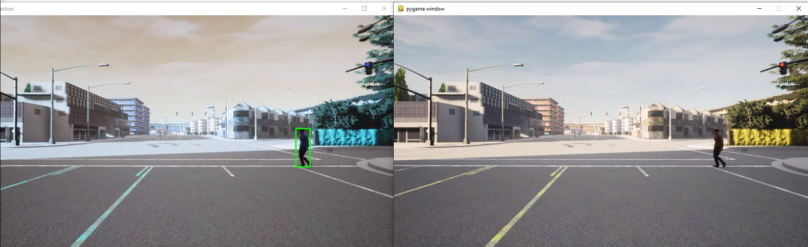

# Carla Pedestrian Detection
This pedestrian detection uses YOLO and cv2


 
## Steps:

1. Get this github repository in CARLA\WindowsNoEditor\PythonAPI\examples.
  It should look like this:
  
```
.CARLA_0.9.9            
├── WindowsNoEditor
│   │   ├── CarlaUE4
│   │   ├── Co-Simulation
│   │   ├── Engine
│   │   ├── HDMaps
│   │   ├── PythonAPI
│   │   │   ├── carla
│   │   │   ├── util
│   │   │   ├── examples
│   │   │   │ 	├── carla-pedestrian.py
│   │   │   │ 	├── coco.names
│   │   │   │ 	├── yoloyv4-tiny.cfg
│   │   │   │ 	├── yoloyv3-tiny.weights
│   │   │   │ 	├── tensorflow_yolov3    
│   │   │   │ 	│   │  	├── carla
│   │   │   │ 	│   │	│   ├── utils.py 
          
```
2. Download COCO weights from this link:
	```
	https://github.com/YunYang1994/tensorflow-yolov3/releases/download/v1.0/yolov3_coco.tar.gz
	```
	extract this file under the below path:

	> ..\CARLA_0.9.9\WindowsNoEditor\PythonAPI\examples\tensorflow-yolov3\checkpoint
3. (type these command at the  ..\CARLA_0.9.11\WindowsNoEditor\PythonAPI\examples\tensorflow-yolov3)
	```
	cd..
	python convert_weight.py
	python freeze_graph.py
	```

4. Run spawn actor python file for  adding pedestrians or vehicles.

	```python spawn_npc.py```

5. Run pedestrian detection code

 	```python carla-pedestrian.py```


You should see two windows like this:


Control the car in the pygame window with WASD keys (this will be laggy, please be patient)
